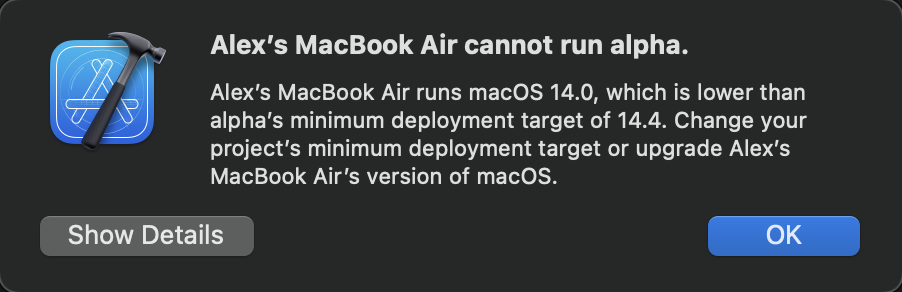
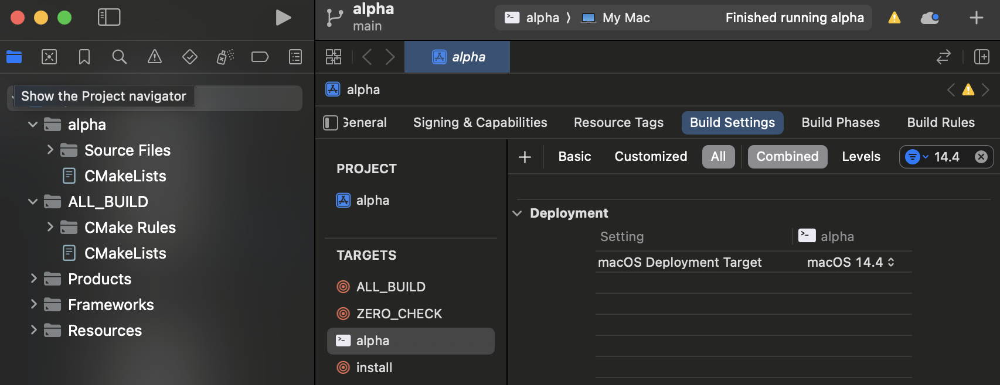

# conan-xcode

## Requirements
* Git >= 2.39.3
* Python >= 3.12.2
* CMake >= 3.29.2

## Install Conan
```
python -m venv venv
source venv/bin/activate
pip install conan==2.2.2
```

## Conan Project `alpha`
1. Create project
```
conan new cmake_exe -d version=1.0 -d name=alpha
```

2. Add https://github.com/boost-ext/ut as a dependency: https://github.com/yesmanchyk/conan-xcode/commit/eb4951be198b52eebcca3f84e8330322c5d3a035

3. Install dependencies
```
conan install . --output-folder=xcode --build=missing -s build_type=Debug
```

4. Generate Xcode project
```
pushd xcode/build/Debug/generators/
cmake ../../../.. -DCMAKE_TOOLCHAIN_FILE=conan_toolchain.cmake -DCMAKE_BUILD_TYPE=Debug -G Xcode
popd
```

5. Open`xcode/build/Debug/generators/alpha.xcodeproj` in Xcode

6. Select `alpha` target


7. Run with `Cmd+R`

8. You may see the MacBook Air cannot run alpha error.
 

9. To fix that click on project, select `Build Settings` and search for `macOS Deployment Target`


10. Select your macOS version and you'll be able to run the project now.

11. Use `boost::ut` like here https://github.com/yesmanchyk/conan-xcode/commit/94f9109ee335b8b44fc2d4f0538310bc3e602bc8. You may run your tests in terminal using conan.
```
conan create . --build=missing
```

12. You can also build and run tests without Xcode.
```
conan install . --build=missing -s build_type=Debug
pushd build/Debug/generators/
cmake ../../.. -DCMAKE_TOOLCHAIN_FILE=conan_toolchain.cmake -DCMAKE_BUILD_TYPE=Debug
cmake --build . && ./alpha
```

13. When you create new file in Xcode, make sure you update `CMakeLists.txt`.

14. You can also add more dependencies, after that you'll need to repeat steps 3. and 4. to regenerate project:
```
bash regenerate.sh
```