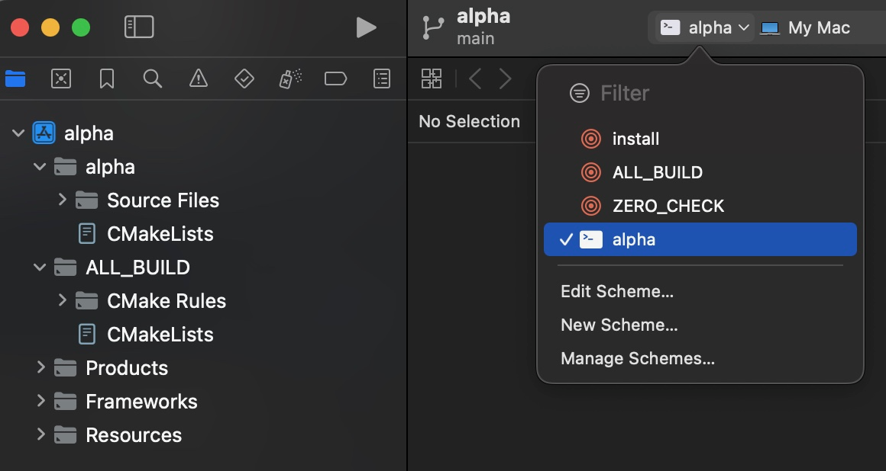

# conan-xcode

## Requirements
* Git >= 2.39.3
* Python >= 3.12.2
* CMake >= 3.29.2

## Install Conan
```
python -m venv venv
source venv/bin/activate
pip install conan==2.2.2
```

## Conan Project `alpha`
1. Create project
```
conan new cmake_exe -d version=1.0 -d name=alpha
```

2. Add https://github.com/boost-ext/ut as a dependency: https://github.com/yesmanchyk/conan-xcode/commit/eb4951be198b52eebcca3f84e8330322c5d3a035

3. Install dependencies
```
conan install . --output-folder=xcode --build=missing -s build_type=Debug
```

4. Generate Xcode project
```
pushd xcode/build/Debug/generators/
cmake ../../../.. -DCMAKE_TOOLCHAIN_FILE=conan_toolchain.cmake -DCMAKE_BUILD_TYPE=Debug -G Xcode
popd
```

5. Open`xcode/build/Debug/generators/alpha.xcodeproj` in Xcode

6. Select `alpha` target


7. Run with `Cmd+R`
